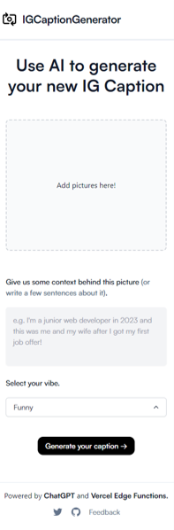

# Instagram Caption Generator

This project generates Instagram captions for you using AI.

[]

## How it works

This project uses the [ChatGPT API](https://openai.com/api/), [Replicate](https://replicate.com/andreasjansson/blip-2/api), and [Vercel Edge functions](https://vercel.com/features/edge-functions) with streaming. It prompts the user to upload an image, the with Replicate, we are given a image description. The user is then able to add context to the photo and select a vibe in which they want their caption to look like. After this, 2 captions are generated based on all the input received.

## Running Locally

After cloning the repo, go to [OpenAI](https://beta.openai.com/account/api-keys) to make an account and put your API key in a file called `.env`. Do the same with [Replicate](https://replicate.com/andreasjansson/blip-2/api).

Then, run the application in the command line and it will be available at `http://localhost:3000`.

```bash
npm run dev
```

## One-Click Deploy

Deploy the example using [Vercel](https://vercel.com?utm_source=github&utm_medium=readme&utm_campaign=vercel-examples):

[](https://vercel.com/new/clone?repository-url=https://github.com/Nutlope/twitterbio&env=OPENAI_API_KEY&project-name=twitter-bio-generator&repo-name=twitterbio)

## Credits

Credits to Nutlope on github for the groundwork for this application. To view his twitterbio generator, please give it a visit (https://github.com/Nutlope/twitterbio)